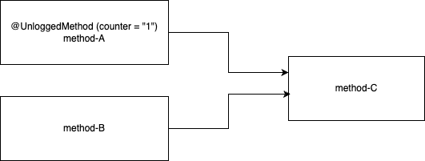

# Logging Mode 

Probing of code can happen in multiple modes. This configuration allows the user to probe only some classes and methods that are of interest. The three modes are:

1. Log all mode
	- This is the default state of SDK, and will be used if nothing is defined. 
	- It can also be defined as an option in main annotation like `@Unlogged(unloggedMode = UnloggedMode.LogAll)`.
	- All methods will be probed by the SDK in this mode.

2. Log Annotated Only
	- This can be configured from main annotation like `@Unlogged(unloggedMode = UnloggedMode.LogAnnotatedOnly)`
	- It will log only classes and methods that are annotated using `@UnloggedClass` and `@UnloggedMethod`
	- This mode does not injects probes for unprobed methods so there will have no performance impact.
	- The counter of Unlogged annotation will be ignored, since any non-annotated method will not be logged.

3. Log Annotated With Children
	- This can be configured from main annotation like `@Unlogged(unloggedMode = UnloggedMode.LogAnnotatedWithChildren)`
	- It will log classes and methods that are annotated using `@UnloggedClass` and `@UnloggedMethod` and the calls that they make to other methods.
	- Non-annotated methods when called from annotated method will be recorded too.
	- The counter of `@Unlogged` annotation will be used for downstream calls. An non-annotated downstream method will be logged only if the parent method is annotated, and both parent and child methods are to be logged from there frequency counter. 

Consider the following scenario:

- Method-A is annotated with `@UnloggedMethod`
- Method-B and C are non-annotated
- Method-A and B call method-C as a downstream call

- The following methods will be recorded based on unlogged mode and methods that are called.

| UnloggedMode 				| Method-A is called | Method-B is called |
|---------------------------|--------------------|--------------------|
| LogAll   					| A, C are logged 	 | B, C are logged	  |
| LogAnnotatedOnly			| A is logged		 | nothing is logged  |
| LogAnnotatedWithChildren	| A,C are logged 	 | nothing is logged  |
