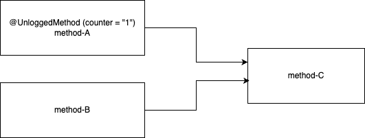

# Logging Mode 

There are four modes to allow complete control over what should be recorded.
This configuration allows the user to probe only some classes and methods that are of interest. 

### Log all mode

```@Unlogged(unloggedMode = UnloggedMode.LogAll)```

- This can be defined as a mode, or will be used if no mode is defined but `@Unlogged` is added.
- All methods will be probed by the SDK in this mode.

### Log Annotated Only

```@Unlogged(unloggedMode = UnloggedMode.LogAnnotatedOnly)```

- It will log only classes and methods that are annotated using `@UnloggedClass` and `@UnloggedMethod`.
- This mode does not injects probes for non-annotated methods so they will not have any performance impact.
- The counter of Unlogged annotation will be ignored, since any non-annotated method will not be logged.

### Log Annotated With Children

```@Unlogged(unloggedMode = UnloggedMode.LogAnnotatedWithChildren)```

- It will log classes and methods that are annotated using `@UnloggedClass` and `@UnloggedMethod` and the calls that they make to other methods.
- The counter of `@Unlogged` annotation will be used for downstream calls. A non-annotated downstream method will be logged only if the parent method is annotated, and both parent and child methods are to be logged from there frequency counter. 

### Log Nothing

```@Unlogged(unloggedMode = UnloggedMode.LogNothing)```

- This can be defined as a mode, or will be used if `@Unlogged` is not added.
- No methods are logged, and thus no test candidates will be generated.
- Features like Direct Invoke will still work.

## Scenario:

- Method-A is annotated with `@UnloggedMethod`.
- Method-B and C are non-annotated.
- Method-A and B call method-C as a downstream call.
- Process wide counter is set to 1.



- The following methods will be recorded based on unlogged mode and methods that are called.

| UnloggedMode 				| Method-A is called | Method-B is called |
|---------------------------|--------------------|--------------------|
| LogAll   					| A and C are logged | B and C are logged |
| LogAnnotatedOnly			| A is logged		 | nothing is logged  |
| LogAnnotatedWithChildren	| A and C are logged | nothing is logged  |
| LogNothing				| nothing is logged  | nothing is logged  |
