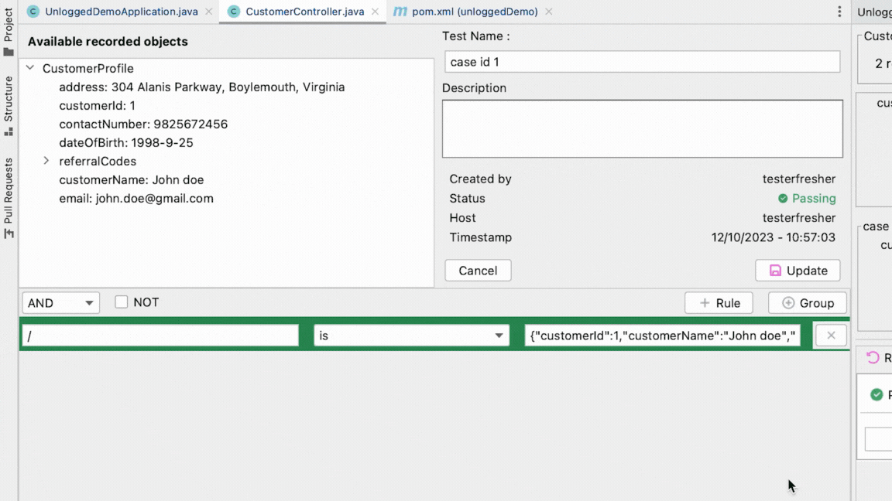

# Saving Candidates

## What's a Candidate? 

When you execute a method using ```Direct Invoke``` or through an http endpoint, you will see the method input values that can be replayed. 

Each unique combination of input and return value is called a Candidate.

!!! tip 
    By default, when you replay a candidate, Unlogged compares the return value object down to the key level. 

But return value may contain ever changing or irrelevant fields such as timestamp. That's where Assertions come in picture.

## Creating Assertions

When you click on :material-content-save:{ .heart }**Save Replay** - you will see a window that presents the recorded value of the object for the candidate we just replayed.  


## Defining Assertions

You can define any assertion on this return value, down to any key/value pair. You can define nested assertions with ```AND``` ```OR``` ```NOT``` on different key-value pairs and **group them together**. 

### List of Operators

Here are the operators, what they do and how it is evaluated on a data type. Also, how a passing and a failing case looks like.

| Operator               | Description for Assertions                   |:octicons-check-circle-24:{ .heart } Passing Case                |:fontawesome-solid-face-grin-tongue-squint:{ .heart } Failing Case               |
|------------------------|----------------------------------------------|---------------------------------|---------------------------------|
| is                     | Asserts that a value is as expected.        | `assertThat(value).is(expected);` | `assertThat(value).is(unexpected);` |
| size is                | Asserts the size of a collection or array.  | `assertThat(list).sizeIs(10);`    | `assertThat(list).sizeIs(5);`      |
| length is              | Asserts the length of a string.            | `assertThat(string).lengthIs(5);` | `assertThat(string).lengthIs(7);`   |
| equals ignore case    | Asserts string equality, ignoring case.    | `assertThat(str1).equalsIgnoreCase(str2);` | `assertThat(str1).equalsIgnoreCase("Different");` |
| is not                 | Asserts that a value is not as expected.    | `assertThat(value).isNot(unexpected);` | `assertThat(value).isNot(expected);` |
| size is not            | Asserts the size is not a specific value.   | `assertThat(list).sizeIsNot(5);` | `assertThat(list).sizeIsNot(10);` |
| length is not          | Asserts the length is not a specific value. | `assertThat(string).lengthIsNot(7);` | `assertThat(string).lengthIsNot(5);` |
| is false              | Asserts that a boolean value is false.     | `assertThat(booleanValue).isFalse();` | `assertThat(trueValue).isFalse();` |
| matches regex         | Asserts that a string matches a regex.      | `assertThat(str).matchesRegex("regexPattern");` | `assertThat(str).matchesRegex("wrongPattern");` |
| not matches regex     | Asserts that a string doesn't match regex. | `assertThat(str).doesNotMatchRegex("wrongPattern");` | `assertThat(str).doesNotMatchRegex("regexPattern");` |
| is true               | Asserts that a boolean value is true.      | `assertThat(booleanValue).isTrue();` | `assertThat(falseValue).isTrue();` |
| <                      | Asserts that a value is less than expected. | `assertThat(number).isLessThan(10);` | `assertThat(number).isLessThan(5);` |
| <=                     | Asserts that a value is less or equal.     | `assertThat(number).isLessOrEqualTo(5);` | `assertThat(number).isLessOrEqualTo(4);` |
| >                      | Asserts that a value is greater than expected. | `assertThat(number).isGreaterThan(20);` | `assertThat(number).isGreaterThan(25);` |
| >=                     | Asserts that a value is greater or equal.  | `assertThat(number).isGreaterOrEqualTo(15);` | `assertThat(number).isGreaterOrEqualTo(16);` |
| is not null           | Asserts that a value is not null.          | `assertThat(value).isNotNull();` | `assertThat(nullValue).isNotNull();` |
| is null               | Asserts that a value is null.              | `assertThat(nullValue).isNull();` | `assertThat(value).isNull();` |
| is empty              | Asserts that a value is empty.             | `assertThat("").isEmpty();` | `assertThat("text").isEmpty();` |
| is not empty          | Asserts that a value is not empty.         | `assertThat("text").isNotEmpty();` | `assertThat("").isNotEmpty();` |
| contains key in object | Asserts the presence of a key in an object. | `assertThat(map).containsKey("key");` | `assertThat(map).containsKey("missing");` |
| contains item in array | Asserts the presence of an item in an array. | `assertThat(array).containsItem(item);` | `assertThat(array).containsItem("notFound");` |
| not contains item in array | Asserts the absence of an item in an array. | `assertThat(array).doesNotContainItem("notFound");` | `assertThat(array).doesNotContainItem(item);` |
| contains substring     | Asserts the presence of a substring in a string. | `assertThat(string).containsSubstring("substring");` | `assertThat(string).containsSubstring("missing");` |
| not contains key in object | Asserts the absence of a key in an object. | `assertThat(map).doesNotContainKey("missing");` | `assertThat(map).doesNotContainKey("key");` |
| not contains substring | Asserts the absence of a substring in a string. | `assertThat(string).doesNotContainSubstring("missing");` | `assertThat(string).doesNotContainSubstring("substring");` |




!!! tip
    Green background color means a passing assertion and red means a failing assertion. 

## Saving the Replays

Replays with assertions are saved at the below location

```/YOUR MODULE DIRECTORY/src/test/resources/unlogged```


!!! nodifference "Replaying with Assertions"
    For your code change, when you replay the candidate, Unlogged will execute the assertion you just saved and inform if the candidate passes or fails the assertions.

## Collaborate

You can now push these replays to your git repository, so that your team members can pull and replay locally for their code changes.