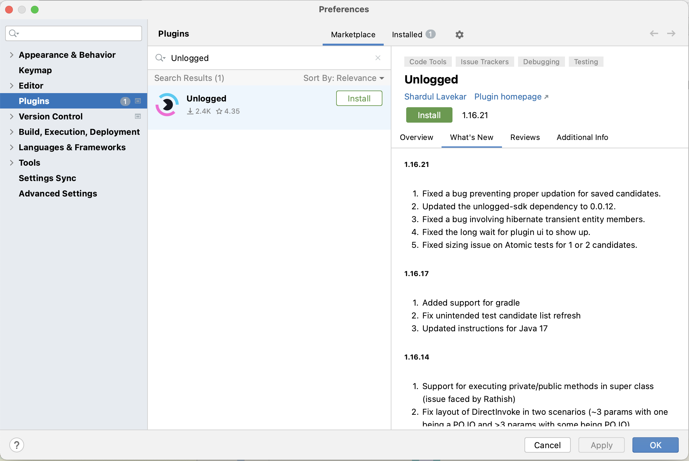

# Getting Started

Install Unlogged, record and replay ```java``` methods, track code coverage, mock external and downstream calls, and create perfectly working JUnit tests. 

### Installing the Plugin

* IntelliJ IDEA --> Preferences --> Plugins --> Marketplace
* Search for Unlogged in the marketplace & Install



### Adding the dependency

=== "maven"
    ``` xml
    <dependency>
      <artifactId>unlogged-sdk</artifactId>
      <groupId>video.bug</groupId>
      <version>0.3.9</version>
    </dependency>
    ```

=== "gradle"
    ``` groovy
    dependencies
    {
        implementation 'video.bug:unlogged-sdk:0.3.9'
        annotationProcessor 'video.bug:unlogged-sdk:0.3.9'
    }
    ```

Sync your project once so that the Unlogged dependency is downloaded from maven repository.

### Adding the annotation
To start recording method input and return values - add ```@Unlogged``` annotation just above your main method.

Here is an example.

```java hl_lines="1"
   @Unlogged
   public static void main(String[] args) {
        SpringApplication.run(JwtDemoApplication.class, args);
    }
```

### Clean, and Debug!

=== "maven"
    ``` maven
    mvn clean
    ```

=== "gradle"
    ``` groovy
    gradle clean
    ```

Start your application in debug mode to call any java function directly.

### Disabling Unlogged

You can disable unlogged either in compile or runtime.

#### Compile Time

=== "maven"
    ``` maven
    mvn package -Dunlogged.disable
    ```

=== "gradle"
    ``` groovy
    ./gradlew build -Dunlogged.disable
    ```

#### Run Time

Update the ```annotation``` on top of your main method.

``` Java
@Unlogged(enable = false)
```

!!!tip "Remember" 

    Note that when you disable the annotation in runtime, the logging probes are still added to your code. But they won't log anything, since the ```enable``` flag is set to ```false```